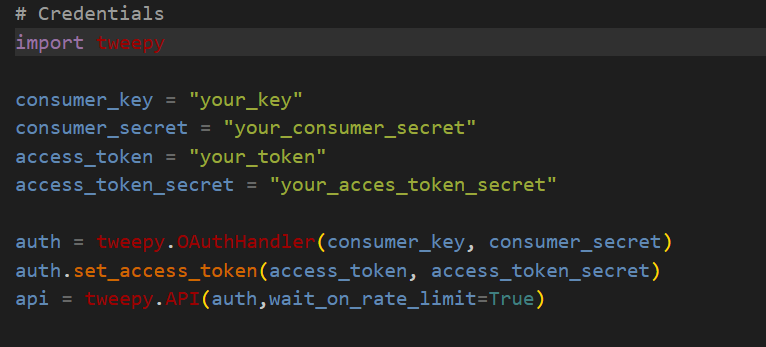

# Stranger Things 4, sentiment analysis

As it's evident from the title, I'll show how to do a Sentiment analysis of Stranger things' [4th season](https://www.netflix.com/be-fr/title/80057281).

I have to admit that in general I don't like *mainstream* TV series. I never watched *"The Walking dead"* or *"Breaking bad"*, even if some friends tried to convince me... and I'm not planning to do it!

But I have to admit that **Stranger things** has something different. The way how is constructed, how the story is told, the nerdy kids as protagonists, or the great 80's *ambience*. 

It really makes me thing about the very good movie from J.J. Abrams ["Super 8"](https://www.imdb.com/title/tt1650062/). Geek kids as protagonists, very well developed story, etc...

Like any season finale of any series, I'm still processing. I'm not sure if I'm happy about it, not completely, and certainly I'm looking forward to season 5. Well done The Duffer Brothers!

Not really a spoiler, but it's worth the mention...the best scene: Eddie playing Metallica *'Master of puppets'*. I simply loved it!

While reflecting on it, I thought *what might be the opinion of other people about the last season?*. That's how I ended up with the idea of this project.

Let's see what's people opinion about it!

# Installation

## Python version
* Python 3.9

## Packages used
* numpy
* pandas
* tweepy
* time
* matplotlib.pyplot
* seaborn
* textblob 
* emoji_translate.emoji_translate 
* nltk
* re
* tensorflow 
* sklearn
* transformers

# Usage
| File                | Description                                                    |
|---------------------|----------------------------------------------------------------|
| tweet_scraping.py         | Tweet scraping functions|
| tweet_cleaner.py         | Data processing for model input|
| sentiment_analysis.py         | Sentiment analysis implementation|
| Sentiment_analysis_stranger_things.ipynb           | Small in between steps |
| df.csv         |      Dataframe with tweets|
# Steps

## 1. Twitter scraping

We don't need to make life more complicated. Like for Twitter scraping, Twitter itself proposes their own API. The only thing that you have to do is to create an account  [here](https://developer.twitter.com/en/docs/twitter-api) in order to get the credentials to access the API.
Then, the piece of code will look like:

The script `tweet_scraping.py` is ready to do the scraping, just fill in your credentials. If you want to search for another hashtag, simply change `text_query = '#strangerthingsseason4'`.

This script saves the tweets as .csv, for further processing.
 
In my case, to have more tweets, I scraped two different hashtags: `#strangerthings` and `"strangerthingsseason4`.

## 2. Tweet processing 

Sometimes tweets can be messy: emojis, special characters, hyperlinks, etc... All these things are difficult to interpret for the model, that's why we need to clean the tweets.
This is done by the script `tweet_cleaner.py`. It uses as input the .csv created in the previous step. The code will get rid of http links, hashtags, retweets, special characters and it will translate emojis. The processed tweets are saved in another .csv which will be used as input to perform the sentiment analysis.

## 3. Sentiment analysis

