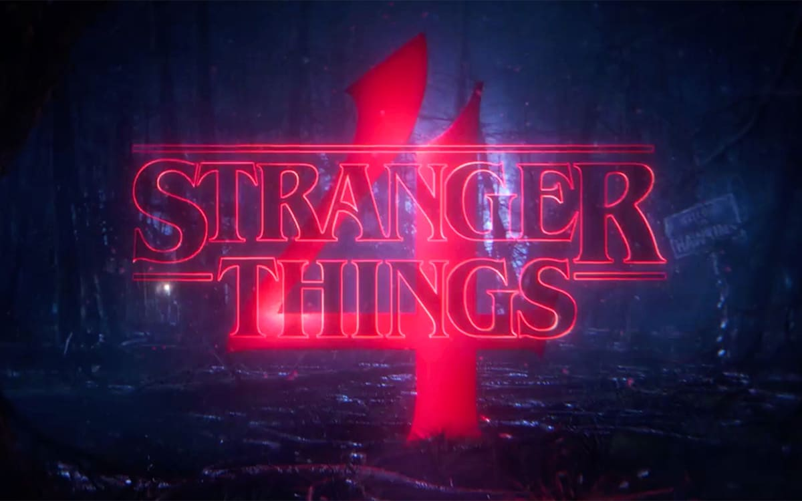

# Stranger Things 4, sentiment analysis

As it's evident from the title, I'll show how to do a Sentiment analysis of Stranger things' [4th season](https://www.netflix.com/be-fr/title/80057281).

I have to admit that in general I don't like *mainstream* TV series. I never watched *"The Walking dead"* or *"Breaking"*, even if some friends tried to convince me... and I don' plan to do it!

But I have to admit that **Stranger things** has something different. The way how is constructed, how the story is told, the nerdy kids as protagonists, or the great 80's *ambience*. 
It really makes me thing about the very good movie from J.J. Abrams ["Super 8"](https://www.imdb.com/title/tt1650062/). Geek kids as protagonists, very well developed story, etc...

Like any season of finale of any series, I'm still processing. I'm not sure if I'm happy about it, not completely, and certainly I'm looking forward to season 5. Well done Duffer Brothers!

While reflecting on it, I thought *what might be the opinion of other people about the last season?*. That's how I ended up with the idea of this project.

Let's see what's people opinion about it!

# Installation

## Python version
* Python 3.9

## Packages used
* numpy
* pandas
* tweepy
* time
* matplotlib.pyplot
* seaborn
* textblob 
* emoji_translate.emoji_translate 
* nltk
* re
* tensorflow 
* sklearn
* transformers

# Usage
| File                | Description                                                    |
|---------------------|----------------------------------------------------------------|
| tweet_scraping.py         | Tweet scraping functions|
| tweet_cleaner.py         | Data processing as model input|
| sentiment_analysis.py         | Sentiment analysis implementation|
| Sentiment_analysis_stranger_things.ipynb           | Small steps |

# Steps

## 1. Twitter scraping

